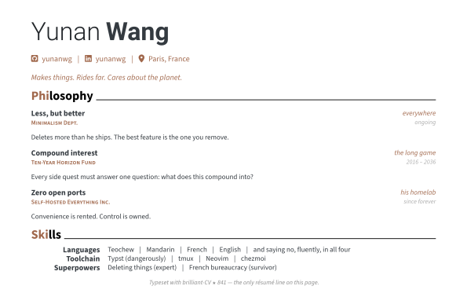

<picture>
  <source media="(prefers-color-scheme: dark)" srcset="assets/cv-dark.svg">
  
</picture>

```
YUNAN(1)                          General Commands Manual                          YUNAN(1)

NAME
       yunan — makes things, rides far, cares about the planet

SYNOPSIS
       yunan [--make] [--ride] [--care] [--lang teochew|zh|en|fr]

DESCRIPTION
       Operates between the lanes of humanities, sustainability and
       technology — never in the middle of any lane. That's the point.

PRINCIPLES
       Deterministic over LLM
              If code can compute it, don't let a model guess it.

       Suggest and confirm
              AI proposes, humans dispose. Authorship is endorsement.

       Self-hosted, zero open ports
              You don't own what you can't self-host.

FILES
       ~/.dotfiles       chezmoi-managed. The mouse is optional.
       /dev/gravel       200 km self-supported. 48 g CO₂ saved.

EXIT STATUS
       Returns 0 unless invoked with npm.

SEE ALSO
       brilliant-CV(1), blog(7) — under reconstruction.

BUGS
       Over-engineers his homelab. Won't fix; works as intended.
       Once sang the same Wu Bai song 14 times, 70 km from home,
       after his earphones died. Also not a bug.
```

<!-- The CV above is typeset from cv/ by .github/workflows/cv.yml — the star
     count refreshes itself weekly. A résumé that maintains itself. -->
<!-- blog(7) slot: wire up gautamkrishnar/blog-post-workflow here once the
     blog is back online. -->
